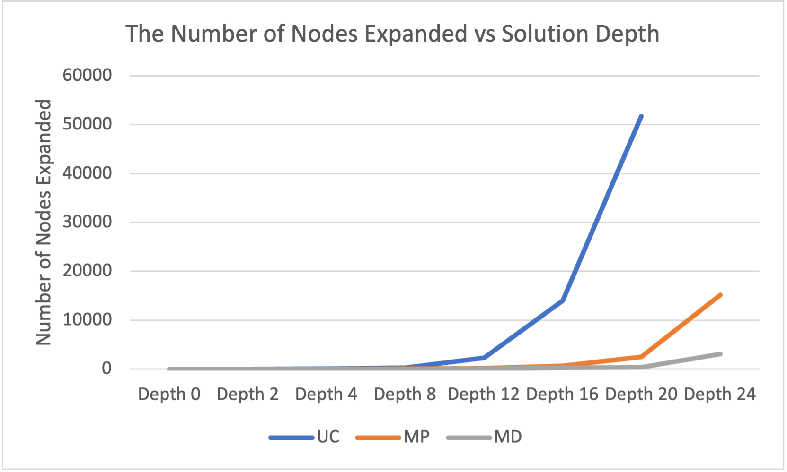

# CS205_Project1: N-Puzzle Problem

Zelai Fang

zfang052@ucr.edu

862395114

## Introduction

The eight puzzle problem consists of a 3×3 board with eight uniquely numbered pieces, ranging from 1 to 8, and an empty space. Adjacent pieces can be moved into the empty space. The objective is to find the shortest sequence of moves required to transform the initial configuration into a target configuration. Each configuration represents a particular arrangement of the pieces on the board. By moving the pieces, the configurations change, and the puzzle is solved by determining a series of intermediate configurations that lead from the initial to the target state. In this project, I will not only try a single eight puzzle problem, but also extend to more general problems, such as 15-puzzle, 24-puzzle, etc. I used python to complete this project and the full code can be seen at the end of the report.

## Algorithms

### Uniform Cost Search

Uniform Cost Search is an algorithm used to solve the Eight Puzzle by exploring the state space and finding the optimal solution with the least cost. It is a variant of the Breadth-First Search (BFS) algorithm, where the priority of expanding nodes is based on the path cost to reach each node.

### A\* with the Misplaced Tile heuristic

The Misplaced Tile heuristic estimates the remaining cost to reach the target state by counting the number of tiles that are not in their correct positions. In other words, it counts the number of tiles in the current state that are different from their corresponding positions in the target state.

### A\* with the Manhattan Distance heuristic

The Manhattan distance heuristic estimates the remaining cost to reach the target state by summing the Manhattan distances of all the tiles in the current state. The Manhattan distance of a tile is defined as the distance between its current position and its target position, measured along the horizontal and vertical axes.

## Result

### Node and Run Time




### Traceback

Using Uniform Cost Search to test sample depth 4

```
Please input the number of X-puzzle:
 (e.g. if you want to solve the 8-puzzle, you need to enter 8)
8
input the value of puzzle, use zero to represent the blank:
row 0 and column 0:
1
row 0 and column 1:
2
row 0 and column 2:
3
row 1 and column 0:
5
row 1 and column 1:
0
row 1 and column 2:
6
row 2 and column 0:
4
row 2 and column 1:
7
row 2 and column 2:
8
Select a method:
1) Uniform Cost Search.
2) A* with the Misplaced Tile heuristic.
3) A* with the Manhattan Distance heuristic.
(e.g. if you want to use Uniform Cost Search, enter 1)
1
The best state to expand with a g(n) = 0 and h(n) = 0 is...
[[1, 2, 3], [5, 0, 6], [4, 7, 8]]

The best state to expand with a g(n) = 1 and h(n) = 0 is...
[[1, 2, 3], [5, 7, 6], [4, 0, 8]]

The best state to expand with a g(n) = 1 and h(n) = 0 is...
[[1, 0, 3], [5, 2, 6], [4, 7, 8]]

...

The best state to expand with a g(n) = 4 and h(n) = 0 is...
[[1, 6, 2], [5, 0, 3], [4, 7, 8]]

The best state to expand with a g(n) = 4 and h(n) = 0 is...
[[0, 1, 2], [5, 6, 3], [4, 7, 8]]

The best state to expand with a g(n) = 4 and h(n) = 0 is...
[[5, 1, 3], [2, 0, 6], [4, 7, 8]]

Depth was: 4
Node expand number: 27
max queue size: 22
Running time: 0.0025060176849365234seconds
```

Using A\* with MP to test sample depth 20

```
Please input the number of X-puzzle:
 (e.g. if you want to solve the 8-puzzle, you need to enter 8)
8
input the value of puzzle, use zero to represent the blank:
row 0 and column 0:
7
row 0 and column 1:
1
row 0 and column 2:
2
row 1 and column 0:
4
row 1 and column 1:
8
row 1 and column 2:
5
row 2 and column 0:
6
row 2 and column 1:
3
row 2 and column 2:
0
Select a method:
1) Uniform Cost Search.
2) A* with the Misplaced Tile heuristic.
3) A* with the Manhattan Distance heuristic.
(e.g. if you want to use Uniform Cost Search, enter 1)
2
The best state to expand with a g(n) = 0 and h(n) = 7 is...
[[7, 1, 2], [4, 8, 5], [6, 3, 0]]

The best state to expand with a g(n) = 1 and h(n) = 7 is...
[[7, 1, 2], [4, 8, 5], [6, 0, 3]]

The best state to expand with a g(n) = 1 and h(n) = 7 is...
[[7, 1, 2], [4, 8, 0], [6, 3, 5]]

...

The best state to expand with a g(n) = 12 and h(n) = 8 is...
[[0, 7, 2], [8, 4, 5], [6, 1, 3]]

The best state to expand with a g(n) = 14 and h(n) = 6 is...
[[7, 2, 8], [6, 5, 4], [3, 1, 0]]

The best state to expand with a g(n) = 14 and h(n) = 6 is...
[[6, 7, 1], [4, 3, 2], [0, 8, 5]]

The best state to expand with a g(n) = 15 and h(n) = 5 is...
[[1, 4, 2], [0, 5, 3], [6, 8, 7]]

Depth was: 20
Node expand number: 2532
max queue size: 1504
Running time: 0.5548360347747803seconds
```

Using A\* with MD to test sample depth 20

```
Please input the number of X-puzzle:
 (e.g. if you want to solve the 8-puzzle, you need to enter 8)
8
input the value of puzzle, use zero to represent the blank:
row 0 and column 0:
7
row 0 and column 1:
1
row 0 and column 2:
2
row 1 and column 0:
4
row 1 and column 1:
8
row 1 and column 2:
5
row 2 and column 0:
6
row 2 and column 1:
3
row 2 and column 2:
0
Select a method:
1) Uniform Cost Search.
2) A* with the Misplaced Tile heuristic.
3) A* with the Manhattan Distance heuristic.
(e.g. if you want to use Uniform Cost Search, enter 1)
3
The best state to expand with a g(n) = 0 and h(n) = 12 is...
[[7, 1, 2], [4, 8, 5], [6, 3, 0]]

The best state to expand with a g(n) = 1 and h(n) = 11 is...
[[7, 1, 2], [4, 8, 5], [6, 0, 3]]

The best state to expand with a g(n) = 2 and h(n) = 10 is...
[[7, 1, 2], [4, 8, 5], [0, 6, 3]]

...

The best state to expand with a g(n) = 19 and h(n) = 1 is...
[[1, 2, 3], [4, 5, 0], [7, 8, 6]]

The best state to expand with a g(n) = 16 and h(n) = 4 is...
[[1, 2, 0], [4, 6, 5], [7, 8, 3]]

The best state to expand with a g(n) = 16 and h(n) = 4 is...
[[1, 6, 2], [4, 5, 3], [7, 8, 0]]

Depth was: 20
Node expand number: 338
max queue size: 218
Running time: 0.04448890686035156seconds
```

## Conclusion

It is evident that uniform search can be computationally expensive as it requires expanding and checking all nodes in the search space. On the other hand, A* algorithms show better performance. Specifically, A* with the Manhattan distance heuristic outperforms A* with the Misplaced Tile heuristic, especially in scenarios where the problem can be solved with a low number of moves. In such cases, the two A* algorithms exhibit similar performance. However, when the problem has a high depth or requires a significant number of moves, A\* with the Manhattan distance heuristic proves to be superior in terms of efficiency and effectiveness.

## Code

URL to my code is: [Github](https://github.com/July-Fang2000/CS205_Project1)

main.py

```python
from math import sqrt
from method import *

# create the arbitrary initial state X-puzzle
size = int(sqrt(int(input("Please input the number of X-puzzle:\n "
                          "(e.g. if you want to solve the 8-puzzle, you need to enter 8) \n"))+1))
puzzle = Puzzle(size)
print("input the value of puzzle, use zero to represent the blank: ")
for i in range(size):
    for j in range(size):
        puzzle.set_val(i, j, value=int(input("row {} and column {}: \n".format(i, j))))
original_puzzle = puzzle.to_array()

# create the goal_puzzle of the X-puzzle problem
goal_puzzle = [[0] * puzzle.size for _ in range(puzzle.size)]
count = 1
for i in range(size):
    for j in range(size):
        goal_puzzle[i][j] = count
        count += 1
goal_puzzle[size-1][size-1] = 0

# use to simple test
# original_puzzle = [[1, 2, 3], [4, 5, 6], [7, 8, 0]]  # Depth 0
# original_puzzle = [[1, 2, 3], [4, 5, 6], [0, 7, 8]]  # Depth 2
# original_puzzle = [[1, 2, 3], [5, 0, 6], [4, 7, 8]]  # Depth 4
# original_puzzle = [[1, 3, 6], [5, 0, 2], [4, 7, 8]]  # Depth 8
# original_puzzle = [[1, 3, 6], [5, 0, 7], [4, 8, 2]]  # Depth 12
# original_puzzle = [[1, 6, 7], [5, 0, 3], [4, 8, 2]]  # Depth 16
# original_puzzle = [[7, 1, 2], [4, 8, 5], [6, 3, 0]]  # Depth 20
# original_puzzle = [[0, 7, 2], [4, 6, 1], [3, 5, 8]]  # Depth 24
# goal_puzzle = [[1, 2, 3], [4, 5, 6], [7, 8, 0]]

# select the method to solve the problem
solve_method = int(input('Select a method: \n'
                         '1) Uniform Cost Search. \n'
                         '2) A* with the Misplaced Tile heuristic. \n'
                         '3) A* with the Manhattan Distance heuristic.\n'
                         '(e.g. if you want to use Uniform Cost Search, enter 1)\n'))

# search the solution
search(original_puzzle, goal_puzzle, solve_method)

```

common.py

```python
class Puzzle:
    def __init__(self, size):
        # Initialize the puzzle with a given size
        self.size = size
        self.val = [[0] * size for _ in range(size)]  # 2D array to represent the puzzle

    def set_val(self, row, col, value):
        # Set the value of a specific position in the puzzle
        self.val[row][col] = value

    def to_array(self):
        # Convert the puzzle to a 2D array format and return it
        array = []
        for i in range(self.size):
            row = []
            for j in range(self.size):
                row.append(self.val[i][j])
            array.append(row)
        return array


class Node:
    def __init__(self, puzzle, row, col):
        # Initialize a node with a puzzle state, row and column position
        self.puzzle = puzzle
        self.h = 0  # heuristic value
        self.g = 0  # cost to reach this node from the start node
        self.row = row  # row position of the empty tile in the puzzle
        self.col = col  # column position of the empty tile in the puzzle

    def __lt__(self, other):
        # Compare two nodes based on their g+h values
        return self.g + self.h < other.g + other.h

```

method.py

```python
import copy
import heapq
import sys
import time

from common import *


def uniform_cost_search():
    cost = 0
    return cost


def a_star_with_misplaced_tile_heuristic(original_puzzle, goal_puzzle):
    # calculate the misplaced between the original puzzle and the goal puzzle
    misplaced = 0
    size = len(original_puzzle)
    for i in range(size):
        for j in range(size):
            if original_puzzle[i][j] != goal_puzzle[i][j] and original_puzzle[i][j] != 0:
                misplaced += 1
    return misplaced


def a_star_with_manhattan_distance_heuristic(original_puzzle, goal_puzzle):
    # calculate the Manhattan distance between the original puzzle and the goal puzzle
    distance = 0
    size = len(original_puzzle)
    goal_dict = {}
    # create a dictionary to map the goal values to their respective locations
    for i in range(size):
        for j in range(size):
            goal_dict[goal_puzzle[i][j]] = (i, j)
    # calculate the Manhattan distance for each value in the original puzzle
    for i in range(size):
        for j in range(size):
            value = original_puzzle[i][j]
            if value != 0:
                row_goal, col_goal = goal_dict[value]
                distance += abs(row_goal - i) + abs(col_goal - j)
    return distance


def search(original_puzzle, goal_puzzle, solve_method):
    start = time.time()

    # find the blank position in original_puzzle
    blank_col, blank_row = 0, 0
    for i in range(len(original_puzzle)):
        for j in range(len(original_puzzle)):
            if original_puzzle[i][j] == 0:
                blank_row, blank_col = i, j

    current_puzzle = Node(original_puzzle, blank_row, blank_col)

    # use the method to get h value come from heuristic algorithm
    if solve_method == 1:
        current_puzzle.h = uniform_cost_search()
    elif solve_method == 2:
        current_puzzle.h = a_star_with_misplaced_tile_heuristic(original_puzzle, goal_puzzle)
    elif solve_method == 3:
        current_puzzle.h = a_star_with_manhattan_distance_heuristic(original_puzzle, goal_puzzle)

    queue = [current_puzzle]  # use heapq as the data structure
    old_puzzle = [original_puzzle]  # record the visited puzzle
    count = -1  # count expand node number
    max_queue = 0  # count the queue size
    tol = 200  # time limit

    while True:
        # if no more nodes can test, this puzzle problem can't solve.
        if len(queue) == 0:
            print("Can't solve this puzzle!")
            return 0

        # get and pop the first puzzle in the heap queue
        q = heapq.heappop(queue)
        count += 1

        # if it gets the goal, end the loop
        if q.puzzle == goal_puzzle:
            print("Depth was: " + str(q.g))
            print("Node expand number: " + str(count))
            print("max queue size: " + str(max_queue))
            print("Running time: " + str(time.time() - start) + "seconds")
            return "Solve this puzzle"

        # print the current puzzle being explored
        print("The best state to expand with a g(n) = " + str(q.g) + " and h(n) = "
              + str(q.h) + " is...\n" + str(q.puzzle) + "\n")

        # expand and get its four neighbors of the node
        new_puzzle = generate_puzzle(q, old_puzzle)

        # update the g and h of each algorithm
        for i in new_puzzle:
            if solve_method == 1:
                i.g = q.g + 1
                i.h = uniform_cost_search()
            elif solve_method == 2:
                i.g = q.g + 1
                i.h = a_star_with_misplaced_tile_heuristic(i.puzzle, goal_puzzle)
            elif solve_method == 3:
                i.g = q.g + 1
                i.h = a_star_with_manhattan_distance_heuristic(i.puzzle, goal_puzzle)
            if i.puzzle not in old_puzzle:
                heapq.heappush(queue, i)
                old_puzzle.append(i.puzzle)

        # update the max_queue size
        if len(queue) > max_queue:
            max_queue = len(queue)

        #  end the program if time limit exceed
        if time.time() > start + tol:
            print('Time Limit Exceeded')
            sys.exit()


def generate_puzzle(current_puzzle, old_puzzle):
    move_puzzle = []
    row, col = current_puzzle.row, current_puzzle.col
    direction = [1, 0, -1, 0, 1]  # defines the directions: right, down, left, up
    for i in range(0, 4):
        current = copy.deepcopy(current_puzzle.puzzle)  # create a deep copy of the current puzzle
        temp = current[row][col]  # temporarily store the value at the current position
        r = row + direction[i]  # calculate the new row position
        c = col + direction[i + 1]  # calculate the new column position
        if r < 0 or r > len(current) - 1 or c < 0 or c > len(current) - 1:
            continue  # if the new position is out of bounds, skip to the next direction
        current[row][col] = current[r][c]  # move the value from the new position to the current position
        current[r][c] = temp  # move the temporarily stored value to the new position
        if current is not None and current not in old_puzzle:
            # check if the new puzzle state is valid and not already explored
            nodes = Node(current, r, c)  # create a new Node with the new puzzle state and position
            move_puzzle.append(nodes)  # add the new Node to the list of neighboring puzzles
    return move_puzzle

```
